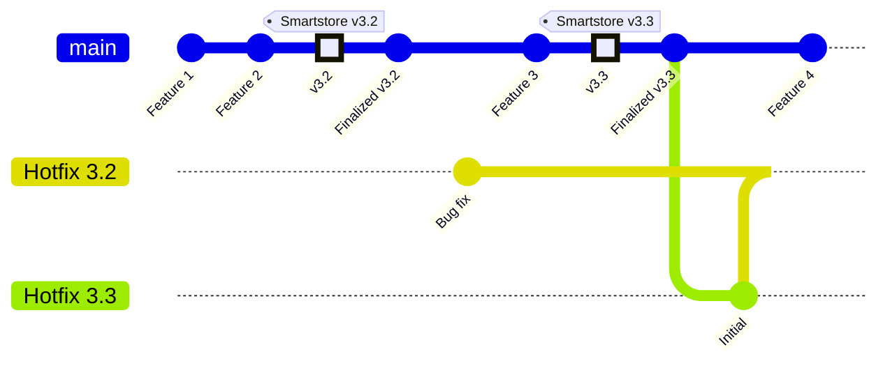

```mermaid
gitGraph
  commit id: "Feature 1"
  commit id: "Feature 2"
  commit id: "v3.2" tag: "Smartstore v3.2" type:HIGHLIGHT
  commit id: "Finalized v3.2"
  branch "Hotfix 3.2"
  commit id: "Initial"
  commit id: "Bug fix"
  checkout main
  commit id: "Feature 3"
  checkout main
  commit id: "v3.3" tag: "Smartstore v3.3" type:HIGHLIGHT
  commit id: "Finalized v3.3"
  branch "Hotfix 3.3"
  commit id: "Initial"
  checkout main
  commit id: "Feature 4"
```
